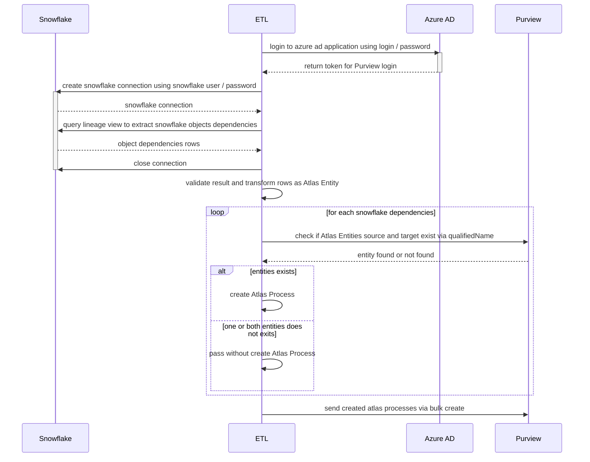

# Script ETL Snowflake Lineage to Purview

Extract Snowflake dependencies via a Snowflake view, transform view lines to Apache Atlas Objects Process and load Atlas Process to Purview Atlas API via bulk create request.

## Run ETL Script

### Prerequisites

- Snowflake view `PRD_RAW.PURVIEW.BLOB_AND_TABLE_MAPPING_VW` must be created in Snowflake account and read access right to the view must be granted to snowflake used user.
- Azure Active Directory Entreprise Application must exists in Azure AD (identified by client_id and client_secret) and correct access write to data domain must be granted in Purview console.

### Expected environment variables

These varenv are extracted and validated by *pydantic-settings*

| Varenv                   | Description                                                          |
| ------------------------ | -------------------------------------------------------------------- |
| PURVIEW_TENANT_ID        | Purview account tenant id                                            |
| PURVIEW_CLIENT_ID        | Azure AD Entreprise Application client id for Purview API access     |
| PURVIEW_CLIENT_SECRET    | Azure AD Entreprise Application client secret for Purview API access |
| PURVIEW_ACCOUNT          | Purview account name                                                 |
| SNOWFLAKE_USER           | Snowflake user name used to query lineage view                       |
| SNOWFLAKE_PASSWORD       | Snowflake user password                                              |
| SNOWFLAKE_WAREHOUSE      | Snowflake warehouse used to query the view                           |
| SNOWFLAKE_AUDIT_DATABASE | Snowflake view database                                              |
| SNOWFLAKE_AUDIT_SCHEMA   | Snowflake view schema                                                |

### Run Script

1. Install dependancies via `poetry install`
2. Run script via poetry `poetry run python main.py`

## ETL

### ETL Process

### Mapping Snowflake --> Apache Atlas

| Snowflake view column | Apache Atlas Json key |
| --------------------- | --------------------- |
| *_DATABASE            | qualified_name        |
| *_SCHEMA              | qualified_name        |
| *_OBJECT_NAME         | name & qualified_name |
| *_OBJECT_DOMAIN       | typeName              |
| DEPENDENCY_TYPE       | NOT_USED              |
| STAGE_URL             | qualified_name        |
